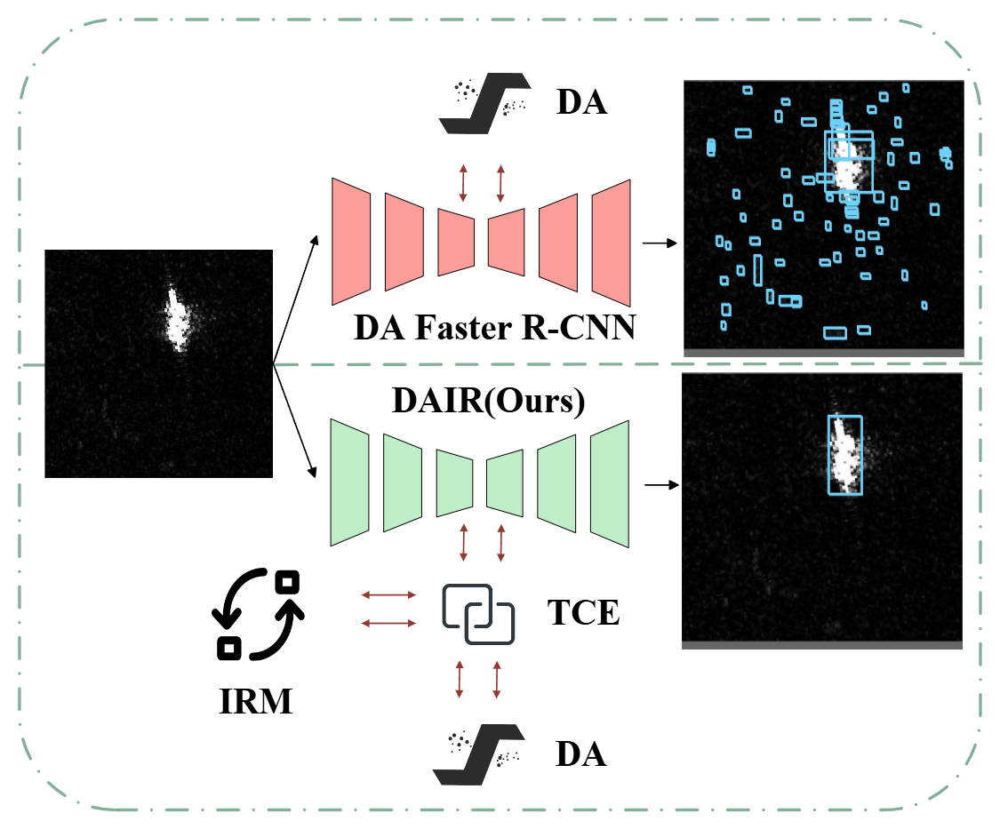

# Optical-to-SAR Domain Adaptive with Inversion Regularization for Unsupervised Ship Detection 


## Introduction
This is a PyTorch/GPU implementation of the unpublished paper Optical-to-SAR Domain Adaptive with Inversion Regularization for Unsupervised Ship Detection, implemented by shijie Wang(wang.shijie@stu.xjtu.edu.cn). 

<p align="center">  
    
</p>  

This implementation is built on [Domain Adaptive Faster R-CNN](https://github.com/krumo/Domain-Adaptive-Faster-RCNN-PyTorch).
If you find this repository useful, please cite the oringinal paper:
```
@inproceedings{chen2018domain,
  title={Domain Adaptive Faster R-CNN for Object Detection in the Wild},
      author =     {Chen, Yuhua and Li, Wen and Sakaridis, Christos and Dai, Dengxin and Van Gool, Luc},
      booktitle =  {Computer Vision and Pattern Recognition (CVPR)},
      year =       {2018}
  }
```
```
@misc{massa2018mrcnn,
author = {Massa, Francisco and Girshick, Ross},
title = {{maskrnn-benchmark: Fast, modular reference implementation of Instance Segmentation and Object Detection algorithms in PyTorch}},
year = {2018},
howpublished = {\url{https://github.com/facebookresearch/maskrcnn-benchmark}},
note = {Accessed: [Insert date here]}
}
```
## Installation

Please follow the instruction in [maskrcnn-benchmark](https://github.com/facebookresearch/maskrcnn-benchmark) to install and use DAIR.
## Example Usage
An example of DAIR adapting from **DIOR** dataset to **SSDD** dataset is provided:
1. Please download dataset [DIOR](https://aistudio.baidu.com/aistudio/datasetdetail/53045) and [SSDD](https://github.com/TianwenZhang0825/Official-SSDD/blob/main/README.md).
2. Symlink the path to the DIOR and SSDD dataset to `datasets/` as follows:
    ```bash
    # symlink the dataset
    cd ~/DAIR
    ln -s /<path_to_DIOR_dataset>/ datasets/DIOR
    ln -s /<path_to_SSDD_dataset>/ datasets/SSDD
    ```
3. Ensure that `~/DAIR/maskrcnn_benchmark/modeling/reverse_backbone` is in your system path. The training log and weight files are saved in the output directory, and you can also update the output location through `~/DAIR/maskrcnn_benchmark/config/defaults`
4. Train the DAIR:
    ```
    python tools/train_net.py --config-file "configs/DAIR_sar/e2e_da_faster_rcnn_R_50_C4_SARdior_to_sar.yaml" 
    ```
4. Test the trained model:
    ```
    python tools/test_net.py --config-file "configs/DAIR_sar/e2e_da_faster_rcnn_R_50_C4_SARdior_to_sar.yaml" 
    ```
### Pretrained Model & Results
~[Pretrained model](https://download.pytorch.org/models/resnet50-19c8e357.pth) with DAIR on Resnet-50 bakcbone for DIOR->SSDD task is provided. 


The following results are all tested with Resnet-50 backbone.

|                   | IRM | MLF | TCE | AP@50 | AP@75 | APm  | 
|:-----------------:|:---:|:---:|:---:|:-----:|:-----:|:----:|
|  DA Faster R-CNN  |     |     |     | 67.9  | 17.0  | 29.1 |
|       DAIR        |     |  ✓  |  ✓  | 66.5  | 26.2  | 33.0 |
|       DAIR        |  ✓  |     |  ✓  | 69.8  | 18.8  | 30.3 |
|       DAIR        |  ✓  |  ✓  |     | 65.7  | 30.1  | 32.9 |
|       DAIR        |  ✓  |  ✓  |  ✓  | 73.0  | 33.0  | 37.0 |


